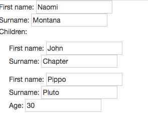

# mdd

Model Driven Development utilities to speed up development of web app.

## Angular Directive

### Example

#### Implementation

```
<mdd schema="schema" data="array" />
```

where `array` is
```
[{
  firstName: 'Naomi',
  surname: 'Montana',
  children:[{
      firstName: 'John',
      surname: 'Chapter' 
    },{
      firstName: 'Pippo',
      surname: 'Pluto',
      age: 30 
    }]
}]
```

#### Result

<b>Rendering</b>



<b>Html</b>

```
<p>
First name: <input type="text" value="Naomi"/>
<br>
Surname: <input type="text" value="Montana" />
<br>
Children:
  <p style="margin-left:20px;">
    First name: <input type="text" value="John"/>
  	<br>
  	Surname: <input type="text" value="Chapter" />
  	<br>
  </p>
  <p style="margin-left:20px;">
    First name: <input type="text" value="Pippo"/>
  	<br>
  	Surname: <input type="text" value="Pluto" />
  	<br>
  	Age: <input type="text" value="30" />
  	<br>
  </p>
</p>
```


## Roadmap

* ~angular directive~
* ~support for visualizing data~
* online demo on bitliner.github.io/mdd
* support for graphQL/mongoQL
* support for writing data
